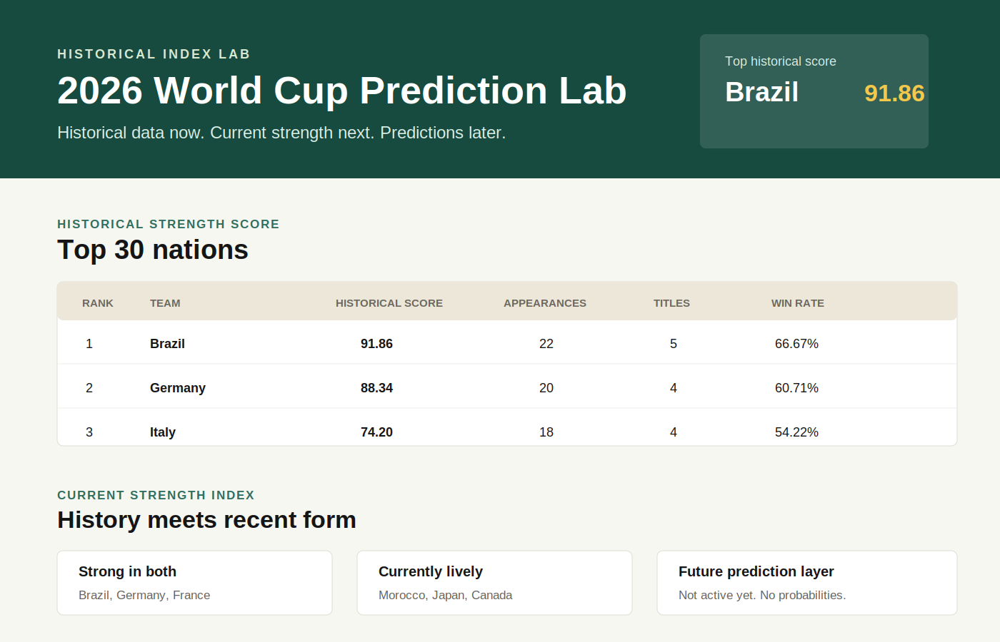
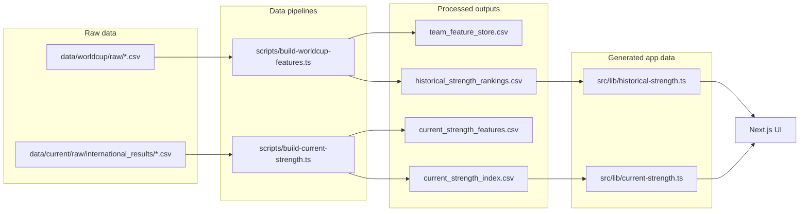

# World Cup Lab

An open-source project exploring World Cup history, current team form, and the data behind football rankings.
Live site: https://worldcuplab.bankeajayi.com

## What is this?

World Cup Lab is a fun side project that combines historical World Cup performance with recent international form.

The goal is not to predict the future. The goal is to explore how football rankings are built, how assumptions affect results, and how different signals can be combined into transparent, explainable scores.

## Disclaimer

This project is for fun and education. It is not certainty, betting advice, or a claim that historical
or current-form indexes can predict World Cup outcomes.

The project currently shows two non-predictive indexes:

- **Historical Strength Score**: World Cup performance history.
- **Current Strength Index**: Phase 1 recent-form signal from open match results.

It does **not** generate prediction probabilities, use machine learning, or provide betting advice.



## Features

- Historical Strength Score table for the top 30 nations.
- Team identity normalization for historical predecessor/successor cases.
- Phase 1 Current Strength Index from recent match form, goal difference, and 2026 host status.
- Side-by-side historical/current comparison view.
- Interactive tournament bracket picks.
- Reproducible data pipelines.
- Data validation and correction reports.
- Raw data kept separate from processed outputs.

## Tech Stack

- Next.js
- TypeScript
- Tailwind CSS
- Node.js scripts for data preparation
- No database
- Optional PostHog analytics via environment variables

## Quick Start

```bash
git clone <your-repo-url>
cd world-cup-lab
npm ci
npm run dev
```

Open [http://localhost:3000](http://localhost:3000).

PostHog is optional. The app runs without analytics configured.

```bash
# .env.local
NEXT_PUBLIC_POSTHOG_PROJECT_TOKEN=phc_your_project_token
NEXT_PUBLIC_POSTHOG_HOST=https://us.i.posthog.com

# Optional: renders a GitHub link in the app and tracks clicks.
NEXT_PUBLIC_GITHUB_URL=https://github.com/your-org/world-cup-prediction-lab
```

The project uses PostHog's official Next.js client setup with `posthog-js` and
`src/instrumentation-client.ts`. Session recordings, feature flags, and autocapture are disabled.

## Scripts

```bash
npm run dev
npm run build
npm run lint
npm run build:features
npm run build:current-strength
```

Recommended release check:

```bash
npm run build:features
npm run build:current-strength
npm run lint
npm run build
```

## Analytics

PostHog analytics are enabled only when `NEXT_PUBLIC_POSTHOG_PROJECT_TOKEN` is set.

Tracked events:

- `$pageview`
- `Team selected`
- `Tournament pick saved`
- `Scatter plot point clicked`
- `Methodology expanded`
- `GitHub link clicked`

Not enabled:

- Session recordings
- Feature flags
- Broad autocapture

Setup reference: [PostHog Next.js documentation](https://posthog.com/docs/libraries/next-js).

## Architecture



## Folder Structure

```text
data/
  current/
    raw/
    processed/
  worldcup/
    raw/
    processed/

docs/
  screenshots/

scripts/
  build-current-strength.ts
  build-worldcup-features.ts

src/
  app/
  components/
  lib/
```

## Historical Strength Score

The Historical Strength Score is a World Cup history index, not a prediction model.

```text
Historical Strength Score =
  0.30 * appearances_score
+ 0.25 * titles_score
+ 0.20 * finals_score
+ 0.15 * semi_finals_score
+ 0.10 * win_rate_score
```

Count metrics are scaled to `0-100` against the strongest normalized men's World Cup nation. Win rate
uses the published World Cup convention: matches decided by penalty shootout are treated as draws for
win-rate calculations.

Historical normalization decisions are documented in [NORMALIZATION_RULES.md](NORMALIZATION_RULES.md).

## Current Strength Index

Phase 1 uses only open data with clear licensing.

```text
Current Strength Score =
  0.65 * recent_form_score
+ 0.25 * recent_goal_difference_score
+ 0.10 * host_advantage_score
```

Included:

- last 20 completed matches
- wins, draws, losses
- points per match
- goals for and against
- average goal difference
- 2026 host flag for Canada, Mexico, and the United States

Excluded for now:

- FIFA rankings
- Elo ratings
- prediction probabilities
- machine learning

Full methodology: [CURRENT_STRENGTH_INDEX.md](CURRENT_STRENGTH_INDEX.md).

## Data Sources And Licenses

### World Cup historical data

- Source: DataHub `football/worldcup`
- Upstream: Fjelstul World Cup Database by Joshua C. Fjelstul, Ph.D.
- License: Creative Commons Attribution-ShareAlike 4.0 International
- Raw files: `data/worldcup/raw/`

### Current results data

- Source: `martj42/international_results`
- License: CC0 1.0 Universal
- Raw files: `data/current/raw/international_results/`

See [DATA_SOURCES.md](DATA_SOURCES.md) for exact download URLs, license notes, and access dates.

## Generated Outputs

Historical outputs:

- `data/worldcup/processed/team_feature_store.csv`
- `data/worldcup/processed/historical_strength_rankings.csv`
- `data/worldcup/processed/historical_strength_top_30.csv`
- `src/lib/historical-strength.ts`

Current-strength outputs:

- `data/current/processed/current_strength_features.csv`
- `data/current/processed/current_strength_index.csv`
- `src/lib/current-strength.ts`

Validation/inventory outputs:

- `data/worldcup/processed/data_inventory.md`
- `data/current/processed/current_strength_validation.md`
- `VALIDATION_REPORT.md`
- `WIN_RATE_CORRECTION_REPORT.md`
- `validation_summary.csv`
- `win_rate_correction_summary.csv`

## Validation Reports

- [VALIDATION_REPORT.md](VALIDATION_REPORT.md): historical top-20 feature-store audit.
- [WIN_RATE_CORRECTION_REPORT.md](WIN_RATE_CORRECTION_REPORT.md): penalty-shootout win-rate correction summary.

Current validation status:

- Historical appearances, titles, finals, semi-finals, goals scored, and goals conceded validate for
  the top-20 audit.
- Win-rate convention was corrected so penalty shootouts count as draws.
- Czechoslovakia remains a documented source/team-scope audit item.

## Known Limitations

- This is not a prediction model.
- Current Strength Phase 1 does not adjust for opponent quality.
- Friendlies and competitive matches are weighted equally in Phase 1.
- Host advantage is a simple 2026 host flag, not a venue-by-venue model.
- FIFA rankings and Elo ratings are intentionally excluded until licensing/source choices are settled.
- `average_finish_position_estimate` is estimated because the source standings table does not provide
  full placement for every team.
- Some historical identity merges are subjective and documented rather than hidden.
- The README image is a screenshot-style preview; see `docs/screenshots/README.md` for replacing it
  with a real browser screenshot.

## Release Checklist

- No API keys or secrets are required.
- Raw CSVs are committed separately from processed outputs.
- Generated TypeScript data modules are included so the app runs without fetching data at runtime.
- Run `npm ci` after cloning.
- Run `npm run build:features` and `npm run build:current-strength` to regenerate data.
- Run `npm run lint` and `npm run build` before publishing.
